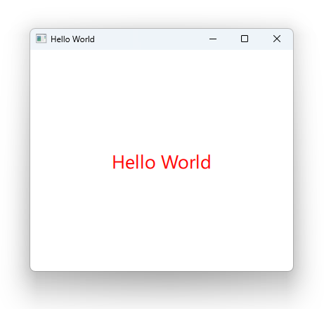

# Notes to self
    . Test application to test the waters in QML
    . Creating the qml project in Qt Creator
    . Different tools to run qml : 
        . Qt Creator Project
        . qmlscene
        . Qt Creator QML prototype
    . Showing the files that make up the project
        . The CMakeLists.txt file
        . The main.cpp file
        . The main.qml file

       
---

# Hello World

---

# Notes to self
* Don't show the code in the slides as students will discover that in Qt Creator as we do our work

