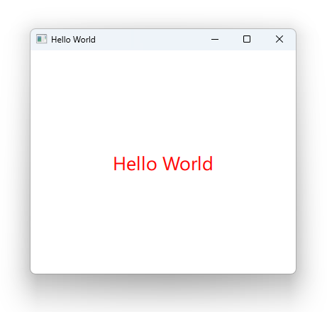

# Notes to self
    . Exploring different ways to run QML : 
        . Qt Creator Project
        . qmlscene
        . qml
        . Qt Creator Qt Quick Prototype

       
---

# Hello World

---

# Options
* Qt Creator Project
* qmlscene
* qml
* Qt Creator Project Prototype

