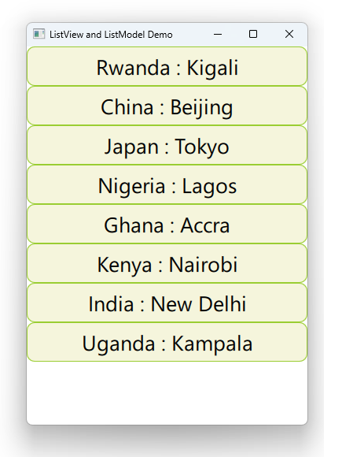

# Notes to self
    . Exploring ListView and ListModel
    . When you connect a delegate to a view with something like :
            . delegate : delegateId
       the delegate gets access to the attributes defined in the
        model that the view is displaying.

    . Start by using an external delegate
    . Then use an inline one.

        
---

# ListView and ListModel


---

# ListView
```qml
    ListView {
        id : mListViewId
        anchors.fill: parent
        model : mModelId
        delegate : delegateId
    }
```

---

# Model
```qml
    ListModel {
        id : mModelId
        ListElement {
            country : "Rwanda"; capital : "Kigali"
        }
        ListElement {
            country : "China"; capital : "Beijing"
        }
        ListElement {
            country : "Japan"; capital : "Tokyo"
        }
        ListElement {
            country : "Kenya"; capital : "Nairobi"
        }
        ListElement {
            country : "India"; capital : "New Delhi"
        }
    }
```

---

# Delegate
```qml
    Component {
        id : delegateId
        Rectangle {
            id : rectangleId
            width: parent.width
            height: 50
            color: "beige"
            border.color: "yellowgreen"
            radius: 10

            Text {
                id : textId
                anchors.centerIn: parent
                font.pointSize: 20
                text : country + " : " + capital
            }

            MouseArea {
                anchors.fill: parent
                onClicked: {
                    console.log("Clicked on :"+ capital + ", "+ country)
                }
            }
        }
    }
```

---


# inline delegate
* It's possible for the delegate to be specified directly into the ListView element
* It's however good practice to separate things out for reusability and maintenace


---


## CMake
```cmake
find_package(Qt6 6.2 COMPONENTS Quick QuickControls2 REQUIRED)
...
target_link_libraries(app2-Button
    PRIVATE Qt6::Quick Qt6::QuickControls2)

```

