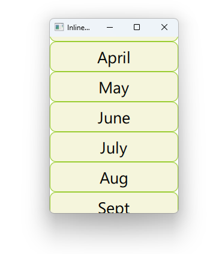

# Notes to self
    . Exploring Inline Models
    . You can specify a list of things that the model will display in a
        square bracketted list.

    . The delegate fetches what to display throught the modelData property.
        
---

# Inline model


---

# ListView and ListModel
```qml
    ListView {
        id : mListViewId
        model : ["January","February","March","April","May","June","July","Aug","Sept","Oct","Nov","Dec"]
        delegate: Rectangle {
            id : rectangleId
            Text {
                id : textId
                text : modelData
            }
            MouseArea {
                onClicked: {
                    console.log("Clicked on :"+ modelData)
                }
            }
        }
    }
```

---


## CMake
```cmake
find_package(Qt6 6.2 COMPONENTS Quick QuickControls2 REQUIRED)
...
target_link_libraries(app2-Button
    PRIVATE Qt6::Quick Qt6::QuickControls2)

```

