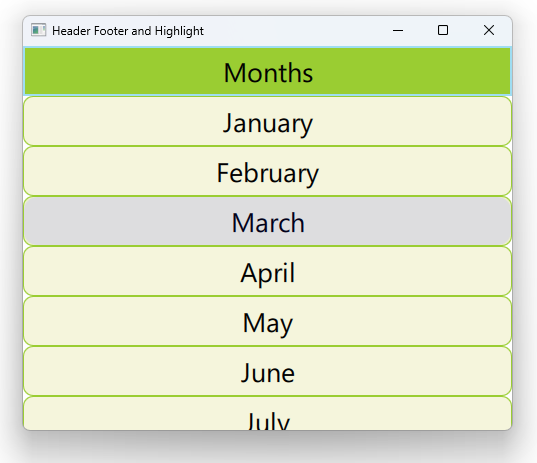

# Notes to self
    . Using header , hightlight and footer with ListView
    . You just specify the respective rectangles.
    . One catch : the hightlight shows up below the content by default here.
        to make it show up on top, you increase its z index, which is what we do here.
    . Improvise based on the info you have here
    . Refer to the Qt5 course if necessary.

        
---

# Header,Footer and Highlight


---

# ListView
```qml
    ListView {
        id : mListViewId
        anchors.fill: parent
        header: headerId
        footer : Rectangle{
            width: parent.width
            height: 50
            color: "dodgerblue"
        }
        highlight: Rectangle{
            width: parent.width
            color: "blue"
            radius: 14
            border.color: "yellowgreen"
            z : 3
            opacity: 0.1
        }

        model : ["January","February","March","April","May","June","July","Aug","Sept","Oct","Nov","Dec"]
        delegate: delegateId
    }
```

---

# Header Component
```qml
    Component {
        id : headerId
        Rectangle {
            id : headerRectId
            width: parent.width
            height: 50
            color: "yellowgreen"
            border {color: "#9EDDF2"; width: 2}
            Text {
                anchors.centerIn: parent
                text : "Months"
                font.pointSize: 20
            }

        }
    }
```

---


## CMake
```cmake
find_package(Qt6 6.2 COMPONENTS Quick QuickControls2 REQUIRED)
...
target_link_libraries(app2-Button
    PRIVATE Qt6::Quick Qt6::QuickControls2)

```

