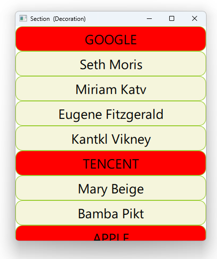

# Notes to self
    . Exploring how to group list items by criteria
    . We that by adding a section property in the ListView
    . Steal the explanations in the Qt5 course and put them
        in the slides

     . Based on provided info, do improvise.
    
---

# Section Decorations


---

# The Model
```qml
    ListModel {
        id : mListModel

        ListElement {
            names : "Kantkl Vikney"; company : "GOOGLE"
        }
        ListElement {
            names : "Mary Beige"; company : "TENCENT"
        }
        ListElement {
            names : "Brad Mend"; company : "APPLE"
        }
        ListElement {
            names : "Pick Mo"; company : "BAIDU"
        }
        //...
    }
```

---

# ListView
```qml
    ListView {
        id : mListViewId
        model : mListModel
        delegate: delegateId
        section {
            property: "company"
            criteria: ViewSection.FullString
            delegate: Rectangle{
                id : sectionRectId
                color: "red"
                Text {
                    id : sectionTextId
                    text : section
                }
                MouseArea {
                    onClicked: {
                        console.log("Clicked on : " + section)
                    }
                }
            }
        }
    }
```

---


# Regular Delegate
```qml
   Component {
        id : delegateId
        Rectangle {
            id : rectangleId
            color: "beige"

            Text {
                id : textId
                text : names
            }
            MouseArea {
                onClicked: {
                    console.log("Clicked on : " + names)
                }
            }

        }
    }
```

---


## CMake
```cmake
find_package(Qt6 6.2 COMPONENTS Quick QuickControls2 REQUIRED)
...
target_link_libraries(app2-Button
    PRIVATE Qt6::Quick Qt6::QuickControls2)

```

