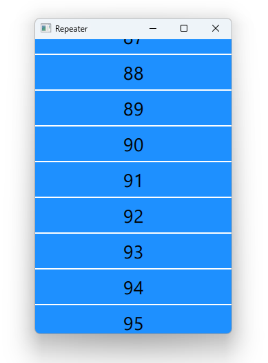

# Notes to self
    . Exploring the Repeater
    . The Repeater type is used to create a large number of similar items
    . The Repeater type creates all of its delegate items when the repeater
        is first created. This can be inefficient if there are a large
        number of delegate items and not all of the items are required
        to be visible at the same time. If this is the case, consider
        using other view types like ListView (which only creates delegate
        items when they are scrolled into view) or use the Dynamic Object
        Creation methods to create items as they are required.

    . Use info above , especially the docs and Qt5 course to improvise on this.

    
---

# Repeater


---

# Repeater
```qml
   Flickable {
        Column {
            id : columnId
            Repeater {

                model : 100
               // model: ["Jan","Feb","March","April","May","June","July","Aug","Sept","Oct","Nov","Dec"]
                delegate : Rectangle {
                    color: "dodgerblue"
                    Text {
                        text: modelData
                    }
                    MouseArea{
                        anchors.fill: parent
                        onClicked: {
                            console.log("Clicked on :"+modelData)
                        }
                    }
                }

            }
        }
    }
```
---


## CMake
```cmake
find_package(Qt6 6.2 COMPONENTS Quick QuickControls2 REQUIRED)
...
target_link_libraries(app2-Button
    PRIVATE Qt6::Quick Qt6::QuickControls2)

```

