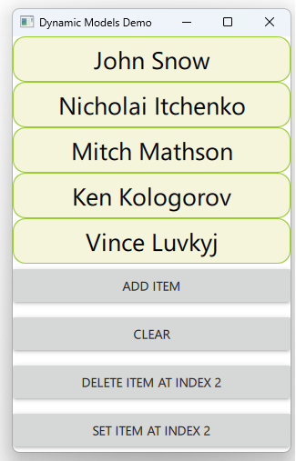

# Notes to self
    . Dynamically adding/removing data from the model
        . append()
        . clear()
        . remove()
        . set()

     . Point to the docs for the student to see other methods they can play with


    
---

# Dynamic Model(Modifications)


---

# Append
```qml
     ColumnLayout {
        anchors.fill: parent
        ListView{
            id : mListViewId
            model:mListModel
            delegate :delegateId
            Layout.fillWidth : true
            Layout.fillHeight: true

        }

        Button {
            text : "Add Item"
            Layout.fillWidth : true
            onClicked: {
               mListModel.append({"firstName": "Daniel", "lastName":"Gakwaya"})
            }
        }
       
    }
```
---


# Clear
```qml
        Button {
            text : "Clear"
            Layout.fillWidth : true
            onClicked: {
                mListModel.clear()
            }
        }
```
---


# Remove
```qml
        Button {
            text : "Delete Item at index 2"
            Layout.fillWidth : true
            onClicked: {
                if ( 2  < mListViewId.model.count){
                    mListModel.remove(2,1)
                }else{
                    console.log("index is invalid")
                }
            }
        }
```
---


# Set
```qml
        Button {
            text : "Set item at index 2"
            Layout.fillWidth : true
            onClicked: {
                mListModel.set(2,{"firstName": "John", "lastName":"Doe"})

            }
        }
```
---


## CMake
```cmake
find_package(Qt6 6.2 COMPONENTS Quick QuickControls2 REQUIRED)
...
target_link_libraries(app2-Button
    PRIVATE Qt6::Quick Qt6::QuickControls2)

```

