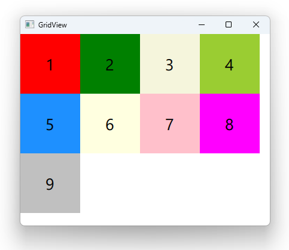

# Notes to self
        . Exploring GridView
        . Shows elements in a Grid
        . Show layoutDirection and Flow
        . Take ref from the docs and the Qt5 course.


    
---

# GridView


---

# GridView
```qml
    GridView{
        id : mGridViewId
        anchors.fill: parent
        //flow : GridView.FlowTopToBottom
        //layoutDirection: Qt.RightToLeft
        model: modelId
        delegate: Rectangle {
            width: 100
            height: width
            color: mColor
            Text {
                text : mNumber
                anchors.centerIn: parent
                font.pointSize: 20
            }
        }
    }
```
---


# The model
```qml
   ListModel {
        id : modelId
        ListElement {
            mNumber: 1
            mColor: "red"
        }
        ListElement {
            mNumber: 2
            mColor: "green"
        }
        ListElement {...}

    }
```
---


## CMake
```cmake
find_package(Qt6 6.2 COMPONENTS Quick QuickControls2 REQUIRED)
...
target_link_libraries(app2-Button
    PRIVATE Qt6::Quick Qt6::QuickControls2)

```

