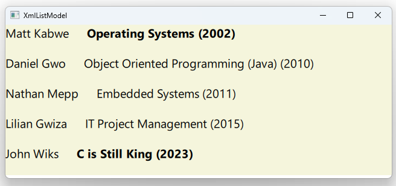

# Notes to self
      . In Qt6 XmlListModel doesn't support XPath queries
        . It supports simple slash-separated paths and,
            optionally, one attribute for each element
        . The querry :
            . query: "/courses/course"
          will target each course element in the XML file and turn it into
            an item for our model

        . We grab the data in the instructor element and make it available
             in our model under the rold "instructor" :
                . XmlListModelRole { name: "instructor"; elementName: "instructor" }
                . elementName specifies the element name in the xml file
                . name specifies the role this will be available as in the view

        . We also read the year and coursename in the same way

        . We also read the hot attribute of the coursename element and make
            it available under the role hot, in the model.

        . All these XmlListModelRoles are just setting up the roles under which
            the data will be available in our model :

                XmlListModelRole { name: "instructor"; elementName: "instructor" }
                XmlListModelRole { name: "year"; elementName: "year" }
                XmlListModelRole { name: "coursename"; elementName: "coursename" }
                XmlListModelRole { name: "hot"; elementName: "coursename"; attributeName: "hot" }

        . Point to the documentation for XmlListModel and XmlListModelRole for more examples.


    
---

# XmlListModel


---

# employees.xml
```xml
<?xml version="1.0" encoding="utf-8"?>
<courses>
<course>
  <instructor>Matt Kabwe</instructor>
  <year>2002</year>
  <coursename  hot ="true">Operating Systems</coursename >
</course>
<course>
  <instructor>Daniel Gwo</instructor>
  <year>2010</year>
  <coursename hot = "false">Object Oriented Programming (Java)</coursename >
</course>
...
</courses>
```
---


# The model
```qml
    XmlListModel {
        id: mXmlListModelId
        source: "qrc:/xml/employees.xml"
        query: "/courses/course"

        XmlListModelRole { name: "instructor"; elementName: "instructor" }
        XmlListModelRole { name: "year"; elementName: "year" }
        XmlListModelRole { name: "coursename"; elementName: "coursename" }
        XmlListModelRole { name: "hot"; elementName: "coursename"; attributeName: "hot" }
    }
```
---


# The view
```qml
    ListView{
        id : mListViewId
        model : mXmlListModelId
        delegate: Rectangle {
            color : "beige"
            Row {
                Text {
                    text : instructor
                }
                Text {
                    text : coursename + " (" + year + ")"
                    font.bold: hot==="true"?true:false
                }
            }
            MouseArea {
                onClicked: {
                    console.log("Clicked on : "+ hot)
                }
            }
        }
    }
```
---


## CMake
```cmake
find_package(Qt6 6.2 COMPONENTS Quick QuickControls2 REQUIRED)
...
target_link_libraries(app2-Button
    PRIVATE Qt6::Quick Qt6::QuickControls2)

```

