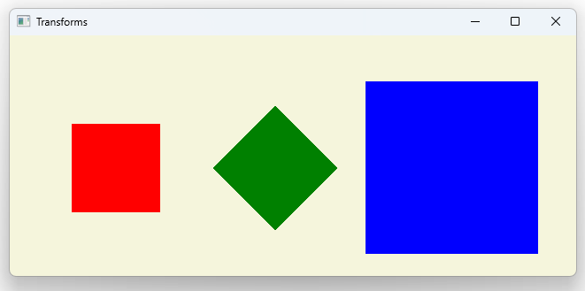

# Notes to self
        . Exploring transforms

            . Translation
            . Rotation
            . Scaling

        . We also show transform origins

        . Add rotation to the last blue rect just for fun in the end

        . Use the info above and the Qt 5 course to improvise.

        
---

# Transforms


---

# ClickableRect.qml
```qml
import QtQuick 2.12

Rectangle {
    id : root
    signal clicked
    MouseArea {
        anchors.fill: parent
        onClicked: root.clicked()
    }
}
```

---

# Translation
```qml
    ClickableRect{
        id : rect1Id
        width: 100
        height: 100
        x : 50
        y : 100
        color: "red"
        onClicked: {
            //Tranlation on x
            x += 20
        }
    } 
```

---

# Rotation
```qml
    ClickableRect{
        id : rect2Id
        width: 100
        height: 100
        //transformOrigin: Item.TopRight
        x : 250
        y : 100
        color: "green"
        onClicked: {
            //Rotation
            rotation += 15
        }
    }  
```

---


# Scaling
```qml
    ClickableRect{
        id : rect3Id
        width: 100
        height: 100
        //transformOrigin: Item.BottomLeft
        x : 450
        y : 100
        color: "blue"
        onClicked: {
            //Scaling
            scale += 0.05
        }
    }   
```

---


## CMake
```cmake
find_package(Qt6 6.2 COMPONENTS Quick QuickControls2 REQUIRED)
...
target_link_libraries(app2-Button
    PRIVATE Qt6::Quick Qt6::QuickControls2)

```

