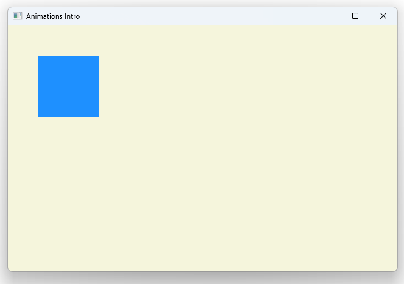

# Notes to self
        . Exploring Animations

            . PropertyAnimation on x
            . NumberAnimation y
            . RotationAnimation on rotation

       . Research on the differences in these when making the videos

       . Improvise.

        
---

# Animations


---

# Animated Rectangle
```qml
        Rectangle {
            id : containedRectId
            color: "dodgerblue"
            PropertyAnimation on x {
                to : 530
                duration: 2000
                running: rootId.running
            }
            NumberAnimation on y {
                to : 300
                duration: 2000
                running: rootId.running
            }
            RotationAnimation on rotation {
                to : 600
                duration: 2000
                running: rootId.running
            }
        }
```

---

# Control the animations
```qml
        MouseArea {
            anchors.fill: parent
            onPressed: {
               rootId.running = true
            }
            onReleased: {
              rootId.running = false
            }
        } 
```

---


## CMake
```cmake
find_package(Qt6 6.2 COMPONENTS Quick QuickControls2 REQUIRED)
...
target_link_libraries(app2-Button
    PRIVATE Qt6::Quick Qt6::QuickControls2)

```

