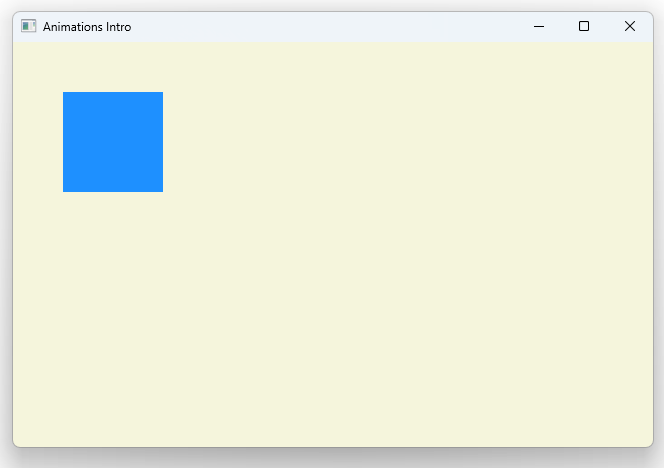

# Notes to self
        . Exploring standalone animations
        . Animations in which you explicitly specify the target element
            to be animated.
        . You have to explicitly start the animation by default
        . Improvise and use the Qt 5 course as a reference if necessary.
        . Ofcourse use the docs


        
---

# Standalone Animations


---

# Animated Rectangle
```qml
        Rectangle {
            id : containedRectId
            color: "dodgerblue"

            NumberAnimation {
                id : mXAnimationId
                target: containedRectId
                property: "x"
                duration: 2000
                to : 530

            }
            RotationAnimation{
                id : mRotationAnimation
                target: containedRectId
                property : "rotation"
                to : 2000
                duration: 2000
            }
        }
```

---

# Freedom
* These animations can live outside the element they are animating. They are free!
* They have to be explicitly started or stoped
* Unlike just going through the running property like we did earlier in the chapter

---

# Control the animation
```qml
        MouseArea {
            anchors.fill: parent
            onPressed : {
                mXAnimationId.start()
                mRotationAnimation.start()

            }
            onReleased: {
                mXAnimationId.stop()
                mRotationAnimation.stop()

            }
        } 
```

---


## CMake
```cmake
find_package(Qt6 6.2 COMPONENTS Quick QuickControls2 REQUIRED)
...
target_link_libraries(app2-Button
    PRIVATE Qt6::Quick Qt6::QuickControls2)

```

