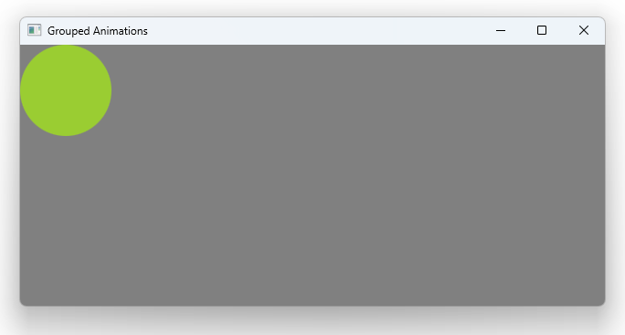

# Notes to self
    . Exploring grouped animations
        . Sequencialanimation
        . ParallelAnimation

    . Use annotations to visualize sequential and parallel animations here

     . Start without the easing
     . Then show the easing.
    . Improvise as you go


        
---

# Grouped Animations


---

# SequentialAnimation and ParallelAnimation
```qml
         SequentialAnimation{
        //ParallelAnimation{
            id : groupedAnimId
            //Animate X
            NumberAnimation{
                target: circleId
                property : "x"
                to : rootId.width - circleId.width
                from : 0
                duration: animationDuration

            }

            //Animate Y
            NumberAnimation{
                //easing.type: Easing.OutBounce
                //easing.amplitude: 3
                target: circleId
                property : "y"
                to : rootId.height - circleId.height
                from : 0
                duration: animationDuration

            }
        }
```

---


# Start the animation
```qml
        MouseArea{
            anchors.fill: parent
            onClicked: {
                console.log("Clicked on gray")
                //Reset the values : x and y
                circleId.x = 0
                circleId.y = 0

                //Animate
                groupedAnimId.start()
            }
        }
```

---


## CMake
```cmake
find_package(Qt6 6.2 COMPONENTS Quick QuickControls2 REQUIRED)
...
target_link_libraries(app2-Button
    PRIVATE Qt6::Quick Qt6::QuickControls2)

```

