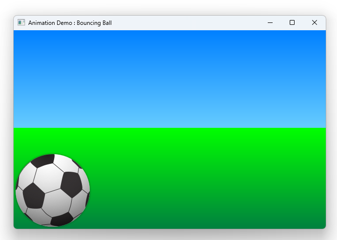

# Notes to self
    . Go through the book on qt 6 and build this example live
    . Take reference from what you did in the Qt 5 course.


        
---

# Animated Ball Bounce


---

# Sky and Ground
```qml
    Rectangle {
        id: sky
        width: parent.width
        height: 200
        gradient: Gradient {
            GradientStop { position: 0.0; color: "#0080FF" }
            GradientStop { position: 1.0; color: "#66CCFF" }
        }
    }
    Rectangle {
        id: ground
        anchors.top: sky.bottom
        anchors.bottom: parent.bottom
        width: parent.width
        gradient: Gradient {
            GradientStop { position: 0.0; color: "#00FF00" }
            GradientStop { position: 1.0; color: "#00803F" }
        }
    } 
```

---


# The ball
```qml
    Image {
        id: ball
        x: 0; y: root.height-height
        source: "qrc:/images/soccerball.png"

        MouseArea {
            anchors.fill: parent
            onClicked: {
                ball.x = 0;
                ball.y = root.height-ball.height;
                ball.rotation = 0;
                anim.restart()
            }
        }
    }
```

---

# Animations
```qml
    ParallelAnimation{
        id : anim
        SequentialAnimation {
            //Ball goes up and down
        }

        NumberAnimation {
            // X1 animation
            target: ball
            properties: "x"
            to: 400
            duration: root.duration
        }

        RotationAnimation {
                target: ball
                properties: "rotation"
                to: 720
                duration: root.duration
            }
    }
```

---

# Up and down SequentialAnimation
```qml
        SequentialAnimation {

            NumberAnimation {
                target: ball
                properties: "y"
                to: 20
                duration: root.duration * 0.4
                easing.type: Easing.OutCirc
            }
            NumberAnimation {
                target: ball
                properties: "y"
                to: root.height-ball.height
                duration: root.duration * 0.6
                easing.type: Easing.OutBounce
            }
        }
```

---


## CMake
```cmake
find_package(Qt6 6.2 COMPONENTS Quick QuickControls2 REQUIRED)
...
target_link_libraries(app2-Button
    PRIVATE Qt6::Quick Qt6::QuickControls2)

```

