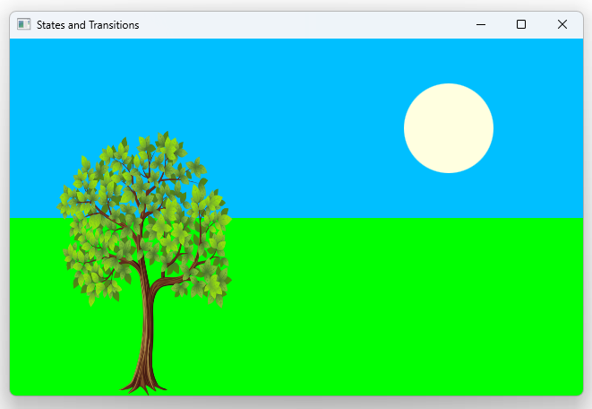

# Notes to self
        . Exploring states and transitions.
        . Start out by putting in the components :
            . sky
            . ground
            . trees
            . sun
        . Put in the states and change them statically in code
        . Put in the states
        . Change states upon mouse click
        . Put in the transitions verbosely
        . Show the other more general syntax for transitions.
        . Improvise.

        
---

# States and Transitions


---

# Sky and ground
```qml
         Rectangle {
            id: sky
            width: parent.width
            height: 200
            color : "blue"
        }

        Rectangle {
            id: ground
            anchors.top: sky.bottom
            anchors.bottom: parent.bottom
            width: parent.width
            color: "lime"
        }  
```

---


# Trees
```qml
        Image {
            id: treespringId
            x : 50
            y : 100
            width : 200
            height: 300
            source: "qrc:/images/treespringsmall.png"
        }
        Image {
            id: treeSummerId
            x : 50
            y : 100
            width : 200
            height: 300
            source: "qrc:/images/treesummersmall.png"
        } 
```

---

# The sun
```qml
         Rectangle {
            id : sun
            x : parent.width - width -100
            y : 50
            width : 100
            height: 100
            color : "yellow"
            radius: 60
        }
```

---

# States
```qml
         states : [
            State {
                name : "summer"
                ...
            },
            State {
                name : "spring"
                ...
            }
        ]
```

---

# Summer
```qml
            State {
                name : "summer"
                PropertyChanges {
                    target: sky
                    color : "lightblue"
                }
                PropertyChanges {
                    target: treeSummerId
                    opacity : 1
                }
                PropertyChanges {
                    target: treespringId
                    opacity : 0
                }
                PropertyChanges {
                    target: ground
                    color : "darkkhaki"
                }
                PropertyChanges {
                    target: sun
                    color : "yellow"
                }
            }
```

---

# Spring
```qml
            State {
                name : "spring"
                PropertyChanges {
                    target: sky
                    color : "deepskyblue"
                }

                PropertyChanges {
                    target: treeSummerId
                    opacity : 0
                }
                PropertyChanges {
                    target: treespringId
                    opacity : 1
                }
                PropertyChanges {
                    target: ground
                    color : "lime"
                }

                PropertyChanges {
                    target: sun
                    color : "lightyellow"

                }

            }
```

---

# Problem
* Changes from one state to another are brutal!
* We can ease things out with transitions

---

# Transitions
```qml
       transitions : [
           Transition {
               from : "summer"
               to : "spring"
               ColorAnimation {
                   duration: 500
               }
               NumberAnimation {
                   properties : "opacity"
                   duration: 500
               }
           },
           Transition {
               from : "spring"
               to : "summer"
               ColorAnimation {
                   duration: 500
               }
               NumberAnimation {
                   properties : "opacity"
                   duration: 500
               }
           }
       ]
```

---

# Any transition
```qml
        transitions : Transition {
            from : "*" ; to : "*"

            ColorAnimation {
                duration: 500
            }
            NumberAnimation {
                properties : "opacity"
                duration: 500
            }
        }
```

---


## CMake
```cmake
find_package(Qt6 6.2 COMPONENTS Quick QuickControls2 REQUIRED)
...
target_link_libraries(app2-Button
    PRIVATE Qt6::Quick Qt6::QuickControls2)

```

