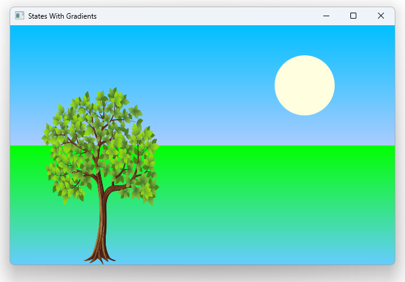

# Notes to self
        . We want to have some gradients applied to the sky and ground.

        . When having gradients that to work with transitions, you don't put a Gradient
            in a property change like this :
            .                 PropertyChanges {
                    target: sky
                    color : "lightblue"
                    //                    gradient : Gradient {
                    //                        GradientStop { position: 0.0; color: "#AA80FF" }
                    //                        GradientStop { position: 1.0; color: "#AACCFF" }
                    //                    }
                }
        . Instead you give your gradient stop elements ids and target them
            in transitions with the desired values :
                .                 PropertyChanges {
                    target: skyStartColorId
                    color : "lightblue"
                }
                PropertyChanges {
                    target: skyEndColorId
                    color : "#EECCFF"
                }
        . Organize the content very well in the slides
        . Use the qt 5 course as a ref and improvise to make this as understandable as possible.


        
---

# States with Gradients


---

# The sky and ground now use gradients
```qml
         Rectangle {
            id: sky
            width: parent.width
            height: 200
            //color : "blue"
            gradient: Gradient {
                GradientStop {id: skyStartColorId; position: 0.0; color: "blue" }
                GradientStop {id : skyEndColorId; position: 1.0; color: "#66CCFF" }
            }
        }

        Rectangle {
            id: ground
            anchors.top: sky.bottom
            anchors.bottom: parent.bottom
            width: parent.width
            //color: "lime"
            gradient: Gradient {
                GradientStop {id: groundStartColorId; position: 0.0; color: "lime" }
                GradientStop {id : groundEndColorId; position: 1.0; color: "#66CCFF" }
            }
        }
```

---


# Problem
* How to we manipulate these gradients when we go from one state to another?

---

# BAD!
```qml
             State {
                name : "summer"
                PropertyChanges {
                    target: sky
                    gradient : Gradient {
                            GradientStop { position: 0.0; color: "#AA80FF" }
                            GradientStop { position: 1.0; color: "#AACCFF" }
                    }
                }
            }
```

---

# Use id's instead. Gradients have ID's
```qml
            State {
                name : "spring"
                PropertyChanges {
                    target: sky
                    color : "deepskyblue"
                }
                PropertyChanges {
                    target: skyStartColorId
                    color : "deepskyblue"
                }
                PropertyChanges {
                    target: skyEndColorId
                    color : "#AACCFF"
                }
                PropertyChanges {
                    target: groundStartColorId
                    color : "lime"
                }
                PropertyChanges {
                    target: groundStartColorId
                    color : "lime"
                }
                //...
            }
```

---

## CMake
```cmake
find_package(Qt6 6.2 COMPONENTS Quick QuickControls2 REQUIRED)
...
target_link_libraries(app2-Button
    PRIVATE Qt6::Quick Qt6::QuickControls2)

```

