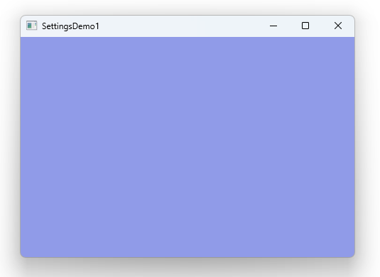

# Notes to self
    . Exploring Settings
    . We let the system save the data automatically
    . All you have to do is put these Settings  components in your
        qml file :
                    Settings{
                        category: "window"
                        property alias x : rootId.x
                        property alias y : rootId.y
                        property alias width : rootId.width
                        property alias height : rootId.height
                    }

                    Settings{
                        category: "colors"
                        property alias rectColor : rectId.color
                    }

      . In other words, we are telling Qt to keep track of these properties for us
            and update them next time when the system starts, with the newest data :
                    . rootId.x
                    . rootId.y
                    . rootId.width
                    . rootId.height
                    . rectId.color
      . Qt does the heavy lifting to achieve that behind the scenes.

      . The price we pay is that any simple change in the properties will trigger a
        call to save the data and that can be heavy performance wise.
      . There is an option to choose when the data is saved, and we look at that in the
        next lecture.

       
---

# XMLHttpRequest


---

# The window
```qml
 
Window {
    id : rootId
    visible: true
    title: qsTr("SettingsDemo1")
    Rectangle {
        id : rectId
        anchors.fill: parent
        color: "red"

        MouseArea{
            onClicked: {
                colorDialogId.open()
            }
            ColorDialog {
                id: colorDialogId
                title: "Please choose a color"
                onAccepted: {
                    rectId.color = selectedColor
                }
                onRejected: {
                    console.log("Canceled")
                }
            }
        }
    }

} 
```

---

# Settings
```qml
    Settings{
        category: "window"
        property alias x : rootId.x
        property alias y : rootId.y
        property alias width : rootId.width
        property alias height : rootId.height
    }

    Settings{
        category: "colors"
        property alias rectColor : rectId.color
    } 
```

---


* In other words, we are telling Qt to keep track of these properties for us and update them next time when the system starts, with the newest data :
    * rootId.x
    * rootId.y
    * rootId.width
    * rootId.height
    * rectId.color
* Qt does the heavy lifting to achieve that behind the scenes.

* The price we pay is that any simple change in the properties will trigger a call to save the data and that can be heavy in performance.
* There is an option to choose when the data is saved, and we look at that in the next lecture.


---


## CMake
```cmake
find_package(Qt6 6.2 COMPONENTS Quick QuickControls2 REQUIRED)
...
target_link_libraries(app2-Button
    PRIVATE Qt6::Quick Qt6::QuickControls2)

```

