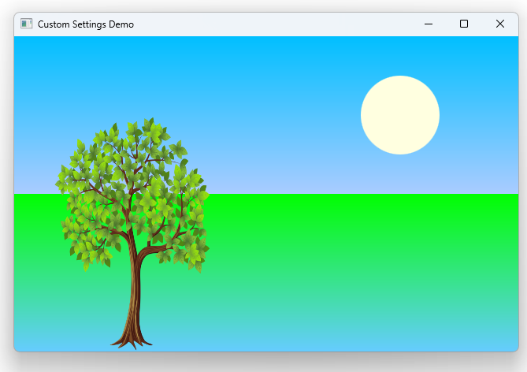

# Notes to self
 

        . Settings saved at an explicit time
        . We use the states and transitions example here just to have
            something different to play with here
        . The flow is :
            . Having a Settings component with the property you want saved :
                .         Settings {
                                id: settings
                                property string state: "spring"
                            }
            . When you need the property in your app, read it from the Settings
                component :
                    .         state : settings.state

            . Change the property as you see fit in your app logic :
                .         MouseArea{
                                anchors.fill: parent
                                onClicked: {
                                    containerRectId.state = (containerRectId.state==="spring"?"summer":"spring")
                                }
                            }
             . Save the property when you choose to :
                .         Component.onDestruction: {
                                settings.state = containerRectId.state

                          }
         . Whether you use Settings automatically or save the data customly like we do
            here is going to be your design choice. My job here is to show you the
            possibilities.  

       
---

# Custom Settings


---

# Settings with Property of Interest
```qml
        Settings {
            id: settings
            property string state: "spring"
        } 
```

---

# Use(Read From) the Property
```qml
         state : settings.state
```

---

# Modify the Property
```qml
        MouseArea{
            anchors.fill: parent
            onClicked: {
                containerRectId.state = (containerRectId.state==="spring"?"summer":"spring")
            }
        } 
```

---

# When to save the data : You choose
```qml
         Component.onDestruction: {
            settings.state = containerRectId.state

        }
```

---


## CMake
```cmake
find_package(Qt6 6.2 COMPONENTS Quick QuickControls2 REQUIRED)
...
target_link_libraries(app2-Button
    PRIVATE Qt6::Quick Qt6::QuickControls2)

```

