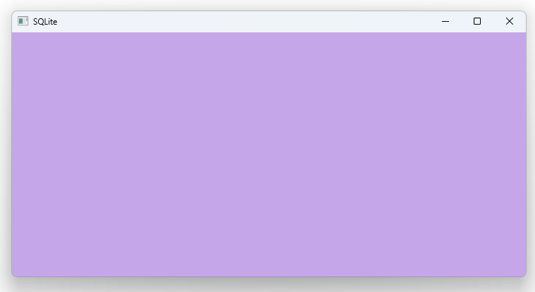

# Notes to self
         . Exploring the usage of the embedded SQLite database
        . Storing data
        . Reading data
        . Showing the location of the database files on the system(main.cpp)
        . Use the Qt 5 course as a reference and make better slides.

       
---

# Custom Settings


---

# Initialize the db
```qml
 function dbInit(){
    console.log(" Initializing database...")

    db = LocalStorage.openDatabaseSync("sqlitedemodb", "1.0", "SQLite Demo database", 100000);
    db.transaction( function(tx) {
        print('... create table')
        tx.executeSql('CREATE TABLE IF NOT EXISTS sqlitedemotable(name TEXT, value TEXT)');
    });
}
```

---

# Store data
```qml

function storeData(){
    if (!db){
        return ;
    }
    db.transaction(function(tx){
        //Check if sqlitedemo entry is available in database table
        var result = tx.executeSql('SELECT * from sqlitedemotable where name = "sqlitedemo"');

        //Prepare json object data from qml code
        var obj = { x: rootId.x, y: rootId.y,
            width : rootId.width,height : rootId.height,
            colorred : containedRectId.color.r,colorgreen : containedRectId.color.g ,
            colorblue : containedRectId.color.b };

        if ( result.rows.length ===1 ){
            //Update
            console.log("Updating database table...")
            result = tx.executeSql('UPDATE sqlitedemotable set value=? where name="sqlitedemo"',
                                    [JSON.stringify(obj)])
        }else{
            //Create entry
            console.log("Creating new database table entry")
            result = tx.executeSql('INSERT INTO sqlitedemotable VALUES (?,?)',
                                    ['sqlitedemo', JSON.stringify(obj)])
        }
    });
}
```

---

# Read Data
```qml

function readData(){
    if (!db){
        return ;
    }
    db.transaction( function(tx) {
        print('... Reading data from database')
        var result = tx.executeSql('select * from sqlitedemotable where name="sqlitedemo"');

        if(result.rows.length === 1){
            //We have data that we can work  with

            // get the value column
            var value = result.rows[0].value;
            // convert to JS object
            var obj = JSON.parse(value)

            // apply to object
            rootId.x = obj.x;
            rootId.y = obj.y;
            rootId.width= obj.width;
            rootId.height = obj.height
            containedRectId.color= Qt.rgba(obj.colorred,obj.colorgreen,obj.colorblue,1)
        }

    });
}
```

---

# User Interface
```qml
    Rectangle{
        id : containedRectId
        anchors.fill: parent
        color: "red"

        MouseArea{
            anchors.fill: parent
            onClicked: {
                colorDialogId.open()
            }

            ColorDialog {
                id: colorDialogId
                title: "Please choose a color"
                onAccepted: {
                    console.log("The new color is : "+ selectedColor)
                    containedRectId.color = selectedColor
                }
                onRejected: {
                    console.log("Canceled")
                }
            }
        }
    }
```

---

# Saving and Loading
```qml
    Component.onCompleted: {
        //Read data
        JS.dbInit()
        JS.readData()
    }

    Component.onDestruction: {
        JS.storeData()
    }
```

---


## CMake
```cmake
find_package(Qt6 6.2 COMPONENTS Quick QuickControls2 REQUIRED)
...
target_link_libraries(app2-Button
    PRIVATE Qt6::Quick Qt6::QuickControls2)

```

