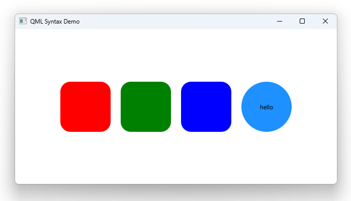

# Notes to self
        . A basic example to generally explore the syntax of qml
        . Main ideas :
            . QML is a declarative language
            . top down hierarchy
            . components can have children
            . components can have unique IDs
            . variables
            . property binding
            . responding to events
            . anchors to position elemetns
         . Reference the video for Qt5 if needed.

       
---

# Hello World

---

# Key Takeaways
    * QML is a declarative language
    * top down hierarchy
    * components can have children
    * components can have unique IDs
    * variables
    * property binding
    * responding to events
    * anchors to position elemetns

---

# Notes to self
* Create the project and show the code as you go
* Don't show code in the slides at this point
* Show the key takeaways slide after everything is explained.

