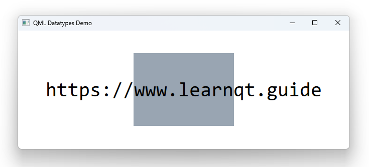

# Notes to self

        Show the docs
        Show from string to url
        Click on var and start exploring : copy the types from the docs and play with them
        End by working with font and date
        Break the lecture in two parts :
        Part1 : from string to url
        Part2 : the rest

       
---

# Data types


---

# Data types (1)
```qml
    property string mString: "https://www.learnqt.guide"
    property int mInt: 45
    property bool isFemale: true
    property double mDouble: 77.5
    property url mUrl: "https://www.learnqt.guide"

```

---

# Data types (2)
```qml
    property var aNumber: 100
    property var aBool: false
    property var aString: "Hello world!"
    property var anotherString: String("#FF008800")
    property var aColor: Qt.rgba(0.2, 0.3, 0.4, 0.5)
    property var aRect: Qt.rect(17, 56, 46, 10)
    property var aPoint: Qt.point(10, 10)
    property var aSize: Qt.size(10, 10)
    property var aVector3d: Qt.vector3d(100, 100, 100)
```

---

# Data types (3)
```qml
    property var anArray: [1, 2, 3, "four", "five", (function() { return "six"; })]
    property var anObject: { "foo": 10, "bar": 20 }
    property var aFunction: (function() { return "Seven"; })
    property var aFont  : Qt.font({family: "Consolas", pointSize: 30, bold: false})
    property date mDate: "2018-07-19"
```


