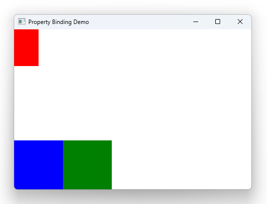

# Notes to self
    . Introduce property bindings
    . Show that changing the binding with a static value breaks the binding
    . Show how to update the binding with the Qt.binding thing

       
---

# Property Bindings


---

# Red
```qml
    Rectangle {
        id : redRectId
        width: 50
        height: width * 1.5
        color: "red"
    }


```

---

# Blue
```qml
    Rectangle {
        id : blueRectId
        color: "blue"
        width: 100
        height: 100
        anchors.bottom: parent.bottom
        MouseArea {
            anchors.fill: parent
            onClicked: {
                redRectId.width = redRectId.width +10
            }
        }
    }
```

---

# Green
```qml
    Rectangle {
        id : greenRectId
        color: "green"
        width: 100
        height: 100
        anchors.bottom: parent.bottom
        anchors.left: blueRectId.right
        MouseArea {
            anchors.fill: parent
            onClicked: {
              //redRectId.height = 100 // Doesn't work
              //redRectId.height = redRectId.width * 1.5 // Doesn't work either

              redRectId.height = Qt.binding(function(){
                return redRectId.width * 2
              })

            }
        }
    }
```


