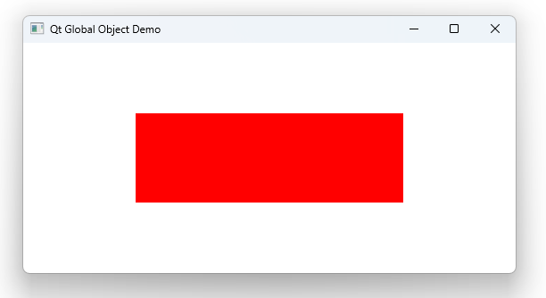

# Notes to self
            . Exploring some facilities from the Qt global object
            . quitting the applications
            . listing available fonts
            . Hashing a string
            . opening urls and local file paths
            . capturing platform information

       
---

# The Qt Global Object


---


```qml
//Quit the application
console.log("Quitting the App")
Qt.quit()


```

---


```qml
//Get all available fonts on the system
property var fonts: Qt.fontFamilies()

//List the available fonts
for( var i = 0; i < fonts.length ; i++){
    console.log("["+ i + "] :" + fonts[i])
}
```

---

```qml
//Hash a string
var mName = "Daniel Gakwaya"
var mNameHash = Qt.md5(mName)
console.log("The hash of the name is :"+ mNameHash)
```

---

```qml
//Open url externally
Qt.openUrlExternally("https://www.learnqt.guide/udemy-discounted-9/")

//Open local files with default program
Qt.openUrlExternally("file:///D:/artwork/LearnQt.png")

//Capture platform info
console.log("The current platform is : "+Qt.platform.os)
```


