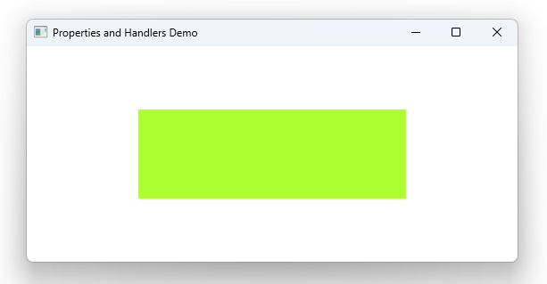

# Notes to self
        . When you define a property, Qt automatically sets up
                a signal that's fired everytime something changes about the property

        . The signal is named on[Propertyname with first leter capitalized]changed

        . Show the signal for existing properties in the app like width and height.


       
---

# Property Handlers


---


# Property Handlers
```qml
Window {
    id : rootId
    title: qsTr("Properties and Handlers Demo")

    property string firstName: "Daniel"
    onFirstNameChanged: {
        console.log("The firsname changed to :"+ firstName)
    }
    onTitleChanged: {
        console.log("The new title is : " + rootId.title)
    }
    Rectangle {
        MouseArea{
            anchors.fill: parent
            onClicked: {
                firstName = "John"
                rootId.title = "The sky is blue"
            }

        }
    }
}
```


