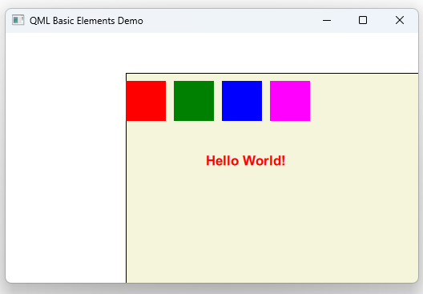

# Notes to self
        . Exploring elements :
            . Rectangle
            . Item
                . An invisible visual item   : docs

            . Text

        . Flow :
            . Start by Item
            . Put in the little colored rectangles
            . Show that you can manipulate their positions just by playing
                with the container invisible item
            . Show the docs for Item and all the properties
            . Put in the beige rect to fill the entire invisible item
            . Show Text

       
---

# Rectangle,Item and Text


---

# Rectangle,Item and Text
```qml
    Item {
        id : containerItemId
        x : 150 ;y : 50
        width: 600
        height: 300

        Rectangle{
            x : 0
            y : 10
            width : 50
            height: 50
            color: "red"
        }

        Text {
            x : 100
            y : 100
            id : mTextId
            text: "Hello World!"
            color: "red"
        }
    }
```


