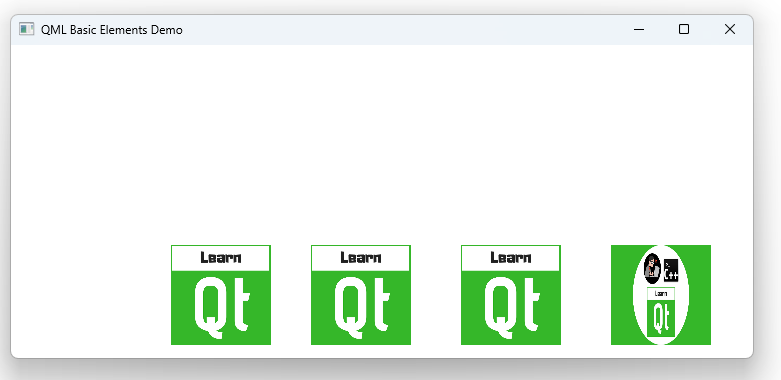

# Notes to self
        . Exploring the Image element
        . Different ways to load images :
            . from working directory
                . Working directory is where your binary is built :
                    for example :
                        F:\OnlineCourses\Qt6QMLForBeginners\3.BasicElements\build-2-Image-Desktop_Qt_6_3_1_MinGW_64_bit-Debug

                . You can find that in Qt Creator by going to Projects-> Kit -> Run

            . from resource file
            . from full path on the local file system
            . from web url path

        . To load image from resource, you have to :
            . set(CMAKE_AUTORCC ON)   in your CMakeLists.txt file
            . use the
                source: "qrc:/images/LearnQt.png"
                syntax in your Image element.

       
---

# Image


---


```qml
         Image {
            x : 10
            y : 150
            width: 100
            height: 100
            //Loading image from the working directory
            source: "file:LearnQt.png"
        }


        Image {
            x : 150
            y : 150
            width: 100
            height: 100
            //Loading image from the resource file
            source: "qrc:/images/LearnQt.png"
        }
```
---


```qml
        Image {
            x : 300
            y : 150
            width: 100
            height: 100
            //Specify the full path to the image
            source: "file:///D:/Artwork/LearnQt.png"
        }


        Image {
            x : 450
            y : 150
            width: 100
            height: 100
            //Specify the full web path to the image
            source: "https://www.learnqt.guide/images/qt_gui_intermediate.png"
        } 
```


