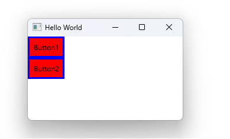

# Notes to self
        . Working with custom componets in QML
            . We start out by exploring Row and Column
            . Then we build the button in the main.qml file
            . We export the button code to its own qml file
            . Encapsulate some properties as invisible from the outside
            . Take notes from the Qt 5 course.

       
---

# Custom Components


---

# MButton.qml
```qml
import QtQuick

Item {
    id : rootId
    property alias buttonText: buttonTextId.text
    width: containerRectId.width
    height: containerRectId.height
    signal buttonClicked

    Rectangle {
        id : containerRectId
        width: buttonTextId.implicitWidth + 20
        height: buttonTextId.implicitHeight + 20
        color: "red"
        border { color: "blue"; width : 3}

        Text {
            id : buttonTextId
            text : "Button"
            anchors.centerIn: parent
            onTextChanged: {
                console.log("Text changed to "+ buttonTextId.text)
            }
        }

        MouseArea {
            anchors.fill: parent
            onClicked: {
                rootId.buttonClicked()
            }
        }
    }
}

```
---

# Using the component


```qml
    Column {
        MButton{
            buttonText : "Button1"
            onButtonClicked: {
                console.log("Clicked on Button 1 from main file")
            }
        }

        MButton{
            buttonText: "Button2"
            onButtonClicked: {
                console.log("Clicked on Button 2 from main file")
            }
        }
    }
```


