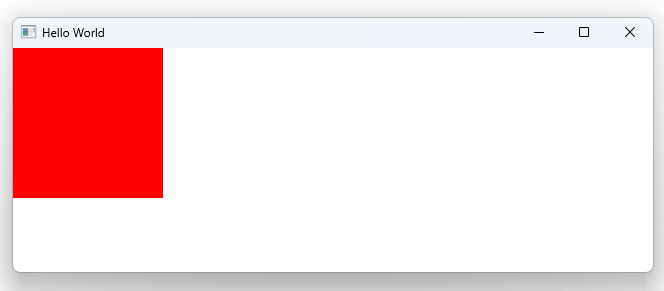

# Notes to self
        . Exploring signal handlers for built in signals
            . Components in QML will have pre-defined signals
            . For example : MouseArea has these signals :
                    canceled()
                    clicked(MouseEvent mouse)
                    doubleClicked(MouseEvent mouse)
                    entered()
                    exited()
                    positionChanged(MouseEvent mouse)
                    pressAndHold(MouseEvent mouse)
                    pressed(MouseEvent mouse)
                    released(MouseEvent mouse)
                    wheel(WheelEvent wheel)

             . You can process any of these signals by setting up a signal
                    handler with the syntax : On<SignalName> with the first
                    letter capitalized. Examples :
                        onClicked:{//Code that responds to click}
                        onEntered: {//Code that responds to Enter}

             . We play with a bunch of them

       
---

# Signal Handlers


---

# Signals from MouseArea
```qml
        MouseArea{
            anchors.fill: parent
            //hoverEnabled: true

            onClicked: {
                console.log("Clicked on the rect")
            }
            onDoubleClicked: {
                console.log("Double clicked on the rect")
            }
            onEntered: {
                console.log("You're in!")
            }
            onExited: {
                console.log("You're out!")
            }
            onWheel: function(wheel) {
               console.log("Wheel : "+ wheel.x)
            }
        }
```


