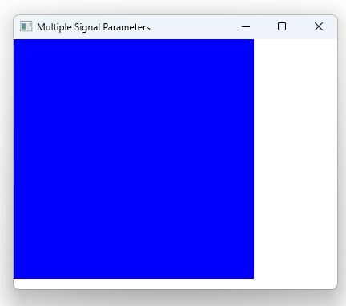

# Notes to self
                    . Handling multiple signal parameters :
                        . https://doc.qt.io/qt-6/qtqml-syntax-signals.html#signal-parameters
                    . Handling all parameters
                    . Handling some parameters
                    . Can only ignore trailing parameters   
---

# Multiple Signal Parameters


---


# Multiple Signal Parameters

```qml
    signal info(string last_name,string first_name,int age)

    //Handle all three parameters
    onInfo: function(l,f,a){
        print("last name : " +l + ", first name : " + f +", age : "+ a)
    } 
```
---


# Multiple Signal Parameters

```qml
    signal info(string last_name,string first_name,int age)

    //Only handle two
    onInfo : function(l,f){
        print("last name : " +l + ", first name : " + f)
    }
```
---


# Multiple Signal Parameters

```qml
    signal info(string last_name,string first_name,int age)

    //Only handle one
    onInfo : function(l){
        print("last name : " +l)
    }
```

---


# Multiple Signal Parameters

```qml
    signal info(string last_name,string first_name,int age)

    //Can only omit trailling parameters. Can't only ignore last name
    onInfo: function(f,a){
        print(" first name : " + f +", age : "+ a)
    }
```

---


# Multiple Signal Parameters

```qml
    signal info(string last_name,string first_name,int age)

    //Non trailling parameters can be ignored through some hack
    onInfo: function(_,f,a){
        print(" first name : " + f +", age : "+ a)
    }
```


