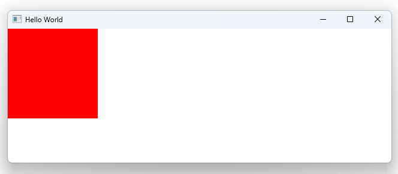

# Notes to self
             . Show how to handle parameters from signals :
                . The bad way  : can just mention the parameter name out of the blue
                        name must be that coming from the signal
                    onClicked: {
                        //Deprecated : Injection of parameters into signal handlers is deprecated. Use JavaScript functions with formal parameters instead warning
                        console.log(mouse.x)
                    }
               . Using explicit js functions  :
                    onClicked: function(mouse){
                        console.log(mouse.x)
                    }
               . Using arrow functions :
                    onClicked: (mouse) => console.log(mouse.x)

               . Multiple parameter signals :
                    . We'll see about that when we know how to setup
                        custom signals.
       
---

# Passing Signal Parameters


---

# Passing Signal Parameters
```qml
        MouseArea{
            anchors.fill: parent
            /*
            onClicked: {
                //Deprecated
                console.log(mouse.x)
            }
            */

            //Explicit Javascript function
            onClicked: function(mouse){
                console.log(mouse.x)
            }

            /*
             //Arrow function
            onClicked: (mouse) => console.log(mouse.x)
            */
        }
```


