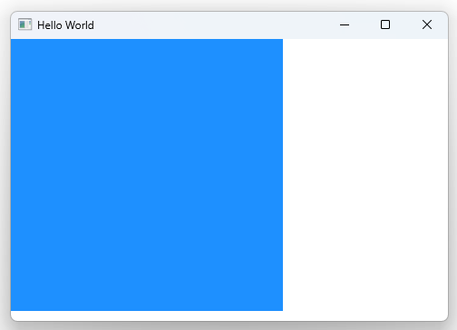

# Notes to self
        . Exploring property change signals

        . For any property you have defined in your QML components,
            QML will set up a signal named on<PropertyName>Changed
            with the property name starting with Capital

         . These signals are generated for properties, not signals

              . For example, for MouseArea, we don'thave an
                onClickedChanged signal, because clicked is a signal
                not a property.
              . But enabled is a property, so it has a changed signal
       
---

# Property Change Signals


---

# Property Change Signals
```qml
    Rectangle{
        id : rect
        width : 300
        height : width
        color : "dodgerblue"

        onWidthChanged: function(){
            console.log("Width changed to :"+ rect.width)
        }
        onHeightChanged: function(){
            console.log("Height changed to :"+ rect.height)
        }
        onColorChanged: {}
        onVisibleChanged: {}

        MouseArea{
            anchors.fill: parent
            onClicked: {
                rect.width = rect.width+20
            } 
        }
    }
```


