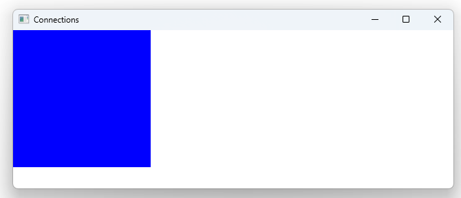

# Notes to self
        . Exploring the Connections component

            . It's used to handle signals outside the block where the
                the signal originates

             . The target property of a Connections object specifies the
                object that will be sending the signal. Named in a confusing
                 way if you ask me

              .The handler is a JS function named exactly like the signal you
                want to handle See :
                    function onClicked(){}
                    onDoubleClicked(){}
       
---

# Connections


---

# Connections
```qml
    Rectangle{
        id : rectId
        width : 200
        height: 200
        color : "blue"
        anchors.left: parent.left

        MouseArea{
            id:mouseAreaId
            anchors.fill: parent
        }

        Connections  {
            target : mouseAreaId
            function onClicked(){
                console.log("Hello")
            }
            function onDoubleClicked(mouse){
                console.log("Doubleclicked at : "+mouse.x)
            }
        }
    }
```


