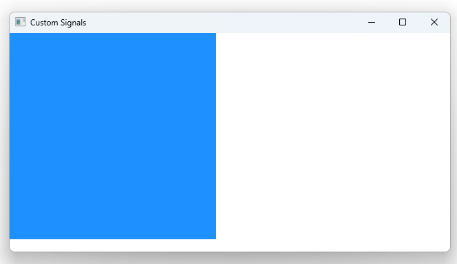

# Notes to self
 
        . Exploring how to set up your own signals
        . The syntax :
            .         signal greet(string message)
        . Qt automatically gives you a handler
            .         onGreet: function(message){
                            console.log("Greeting with message : "+ message)
                        }

         . You fire the signal by calling it like you call a regular javascript function :
            .         MouseArea{
                            anchors.fill: parent
                            onClicked: {
                                //Fire the signal by just calling it like a function
                                rectId.greet("The sky is blue")
                            }
                        }  

       
---

# Custom Signals


---

# Custom Signals
```qml
    Rectangle{
        id : rectId
        width : 300
        height : 300
        color : "dodgerblue"
        anchors.left: parent.left

        //Set up the signal
        signal greet(string message)

        //Once you set up the signal, Qt setup a signal handler automatically
        onGreet: function(message){
            console.log("Greeting with message : "+ message)
        }

        MouseArea{
            anchors.fill: parent
            onClicked: {
                //Fire the signal by just calling it like a function
                rectId.greet("The sky is blue")
            }
        }
    }
```


