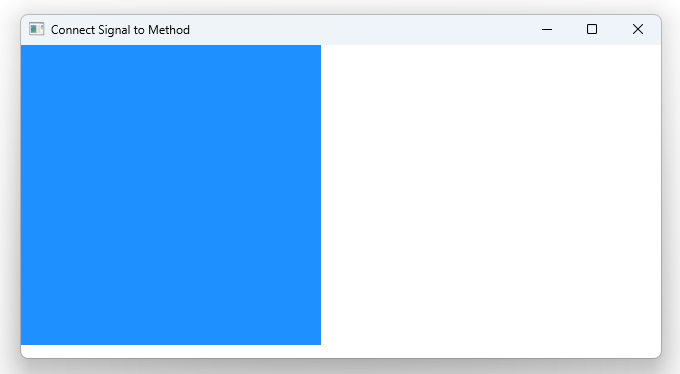

# Notes to self
 
        . Connecting signals to methods
        . You set up your own function :
            .         function respond_your_way(message){
                            console.log("Responding our way;Greeting with message : "+ message)
                        }
        . You do the custom connection :
            .         Component.onCompleted: {
                            //Make the connection explicitly
                            rectId.greet.connect(rectId.respond_your_way)
                        }

         . You have to make a choice as to where  you make the connection. Put
            it where it makes sense in your project 

       
---

# Connect Signal to Method (Slot)


---

# Connect Signal to Method(Slot)
```qml
     Rectangle{
        id : rectId
        width : 300
        height : 300
        color : "dodgerblue"
        anchors.left: parent.left

        //Set up the signal
        signal greet(string message)

        //regular function
        function respond_your_way(message){
            console.log("Responding our way;Greeting with message : "+ message)
        }

        MouseArea{
            onClicked: {
                //Fire the signal by just calling it like a function
                rectId.greet("The sky is blue")
            }
        }
        Component.onCompleted: {
            //Make the connection explicitly
            rectId.greet.connect(rectId.respond_your_way)
        }
    } 
```


