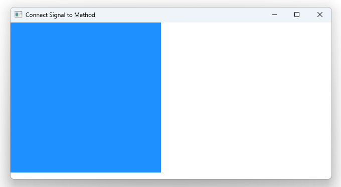

# Notes to self

        . Connecting signals to other signals

        . We have this chain of signals :
                greet -->> forward_greeting -->> slot[respond_your_way]


        . We can connect a signal to another signal with the syntax :
            . rectId.greet.connect(rectId.forward_greeting)
    
---

# Connect Signal to Signal


---

# The signal chain
```
  greet -->> forward_greeting -->> slot[respond_your_way]  
```
---

# Connect Signal to Signal
```qml
    Rectangle{
        id : rectId
        //Set up the signals
        signal greet(string message)
        signal forward_greeting(string message)

        function respond_your_way(message){
            console.log("Responding our way;Greeting with message : "+message)
        }
        MouseArea{
            onClicked: {
                rectId.greet("The sky is blue")
            }
        }
        Component.onCompleted: {
            //Connect a signal to another signal
            rectId.greet.connect(rectId.forward_greeting)
            //Respond to the final signal
            rectId.forward_greeting.connect(rectId.respond_your_way)
        }
    }   
```


