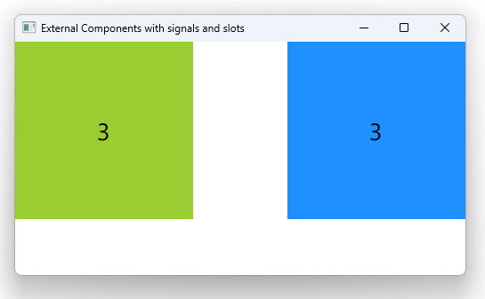

# Notes to self
        . We can connect signals and slots across components
        . We set up :
            . A Notifier
            . A receiver
        . Notifier sends the signal and receiver responds to it

        . A couple of things to notice here :

                . The component is wrapped in an Item to protect internal
                    properties from the outside .

                . components export their width and hight
                       for them to behave well in layout components like Row and Column

                . we export the color to be able to set it from the outside. Two techniques here :
                        . property alias : this automatically forwards changes to the color
                                    from the outside to the inside of Notifier and Receiver

                        . Set up a color property and handle its changed signal to actually
                            apply the color on the inside. Uggly has you have to have handlers
                            all over the place

        . We can do connections from different places (See Qt 5 course for reference) :
            . In Notifier using Component.onCompleted
            . At the root level of the window
            . Inside the notifier object using targets.    
---

# Signals Between Components


---


# Signals Between Components
```qml
Window {
    visible: true
    width: 640
    height: 480
    title: qsTr("External Components with signals and slots")

    Notifier{
        id : notifierId
        rectColor: "yellowgreen"
        target: receiverId
    }

    Receiver {
        id : receiverId
        rectColor: "dodgerblue"
        anchors.right: parent.right
    }
}  
```

---


# Note to self
* Just show the code to use the components in the slides when starting the video and let the students figure out the details as we go through the lecture.


