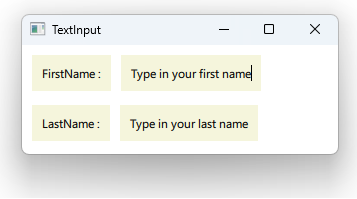

# Notes to self
            . Exploring the TextInput Component :
            . Allows user to type a single line of text
            . Handle the editingFinished signal.
            . Show other signals in the docs 

       
---

# TextInput


---

# TextInput
```qml
        Rectangle {
            id : firstNameRectId
            color : "beige"
            Text {
                id : firstNameLabelId
                text : "FirstName :"
            }
        }

        Rectangle {
            id : firstNameTextRectId
            color : "beige"

            TextInput {
                id : firstNameTextId
                focus: true
                text : "Type in your first name"
                onEditingFinished: {
                    console.log("The first name changed to :"+ text)
                }
            }
        }
```