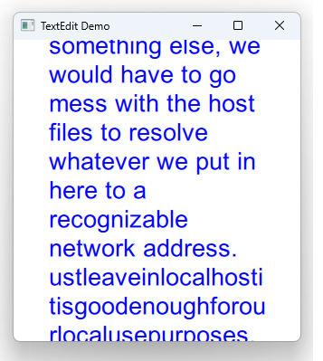

# Notes to self
                . Exploring TextEdit
                . Component to show multiple lines of editable text
                . Steal the TextEdit code from the docs and use that as
                    a starting point
                 . Run without using rich text and show the effect
                 . Run using rich text and show how the html tags are shown
                 . Center the TextEdit
                 . Show that you can delete and type text
                 . Try to type text across multiple lines
                 . Show a long piece of text : the text below
                 . The TextEdit will try to show that on one line
                 . Use the wrap property to make it wrap text to new lines
                 . We can't see all the text
                 . There are ways one can make the text scrollable but
                    there are better tools like TextArea that make these
                    this easier so we'll just stop here for TextEdit.

       
---

# TextEdit


---

# TextEdit
```qml
        TextEdit {
            id : textInputId
            width: 240
            text: "<strong>Because</strong> ..."
            wrapMode: TextEdit.Wrap
            textFormat: TextEdit.RichText
            font.family: "Helvetica"
            font.pointSize: 20
            color: "blue"
            focus: true
            onEditingFinished: {
                console.log("The current text is :"+ text)
            }
        }
```