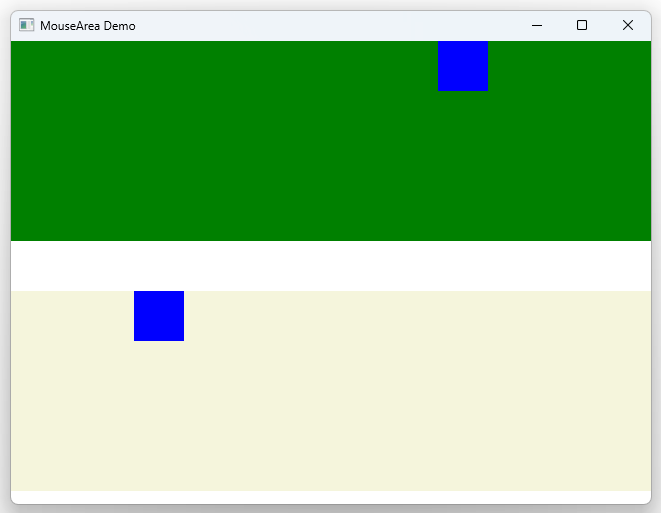

# Notes to self
            . Exploring more about MouseArea
            . The onClicked handler
            . Using the event parameter to print x and y
                . Use functions for this
            . Handling wheel events
            . Handling hover
            . Dragging in another separate rectangle below

       
---

# MouseArea


---

# MouseArea(1)
```qml
        MouseArea{
            anchors.fill: parent
            onClicked: function(mouse) {
                console.log(mouse.x)
                movingRectId.x =  mouse.x
            }

            onWheel:function(wheel) {
                console.log(" X : "+ wheel.x + " y : "+ wheel.y + " angleData :"+ wheel.angleDelta)
            }

            hoverEnabled: true
            onHoveredChanged: {
                if (containsMouse)
                {
                    containerRectId.color = "red"
                }else {
                    containerRectId.color = "green"
                }
            }
        }
```


---

# MouseArea(2)
```qml
        MouseArea{
            anchors.fill : parent
            drag.target: draggableRect
            drag.axis: Drag.XAxis
            drag.minimumX: 0
            drag.maximumX: dragContaierId.width - draggableRect.width

        }
```