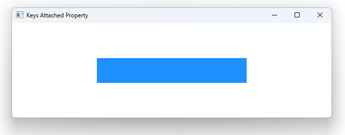

# Notes to self

        . Exploring the Keys attached property
            . You attach it to components that wouldn't know how to
                handle key events otherwise

             . Handle digits without modifiers :
                .  Keys.onDigit1Pressed
                .  Keys.onDigit5Pressed:  //Specific handlers
                .         Keys.onPressed: function(event){
                                if ( event.key ===Qt.Key_1)
                                {
                                     console.log("General Signal :Pressed on Key 1")
                                }
                           }


                   . Then this : // Gneral handlers
                            Keys.onPressed: function(event){
                                if ( event.key ===Qt.Key_1)
                                {
                                     console.log("General Signal :Pressed on Key 1")
                                }

                                if ((event.key === Qt.Key_5) && (event.modifiers & Qt.ControlModifier)){
                                    console.log("Pressed Control + 5")
                                }

                            }

                  . If both specific and general handlers are in, qml favors the specific ones.
                    If you want the general one to also get a chance, you can set event.accepted to false.
                    which is what we talk about in the next point

                    . accepting or rejecting events :
                        . in
                            Keys.onDigit5Pressed:function(event) {
                                console.log("Specific Signal : Pressed on Key 5")
                                event.accepted = true
                            }
                          if accepted is set to true, it means that the event has been fully handled
                          ty this handler and no other handler will get a chance. If you want other handlers
                          to get a chance, you set this to false.


                    . Then talk about modifiers and add them in the code you already have
                    . Do this first :
                                    Keys.onDigit5Pressed:function(event) {
                                       if ( event.modifiers === Qt.ControlModifier)
                                       {
                                           console.log("Pressed Control + 5")
                                       }else{
                                           console.log("Pressed regular 5")
                                       }
                                    }

       
---

# Keys Attached Property


---

# Handling specific Keys
```qml
    Rectangle {
        id : containedRect
        anchors.centerIn: parent
        width : 300
        height: 50
        color: "dodgerblue"
        focus: true // The rectangle needs focus for key events to fire properly

        Keys.onDigit5Pressed:function(event) {
            console.log("Specific Signal : Pressed on Key 5")
            event.accepted = true
        }
    } 
```


---

# Specific Keys with Modifiers
```qml
   Rectangle {
        id : containedRect
        anchors.centerIn: parent
        width : 300
        height: 50
        color: "dodgerblue"
        focus: true // The rectangle needs focus for key events to fire properly

        Keys.onDigit5Pressed:function(event) {
           if ( event.modifiers === Qt.ControlModifier)
           {
               console.log("Pressed Control + 5")
           }else{
               console.log("Pressed regular 5")
           }
        }
    }
```

---

# General Keys (+ with Modifiers)
```qml
   Rectangle {
        id : containedRect
        anchors.centerIn: parent
        width : 300
        height: 50
        color: "dodgerblue"
        focus: true // The rectangle needs focus for key events to fire properly

        Keys.onPressed: function(event){
            if ( event.key ===Qt.Key_5)
            {
                 console.log("General Signal :Pressed on Key 5")
            }
            if ((event.key === Qt.Key_5) && (event.modifiers & Qt.ControlModifier)){
                console.log("Pressed Control + 5")
            }
        }
    }
```