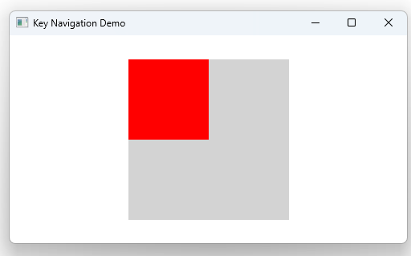

# Notes to self
              . Exploring the KeyNavigation attached property
            . Allows to shift focus to other components in a ui
            . start out with the commented code below
            . Then steal the snippet from the docs and use it
                just for the fun of it.
     
---

# KeyNavigation


---

# KeyNavigation
```qml
          Rectangle {
              id: topLeft
              color: focus ? "red" : "lightgray"
              focus: true

              KeyNavigation.right: topRight
              KeyNavigation.down: bottomLeft
          }

          Rectangle {
              id: topRight
              color: focus ? "red" : "lightgray"

              KeyNavigation.left: topLeft
              KeyNavigation.down: bottomRight
          } 
          //...
```

