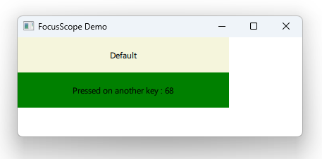

# Notes to self

        . Exploring FocusScope

            . Start out building the rectangle that handles keys 1,2 and others
                Make it beige and make it live in the main file to start with
            . Move it to a separate component to make it reusable and wrap it
                in Item.
                You should export width and height and also allow the user to set
                    the color

            . If you instantiate MButton(the external component) and try to give focus,
                the results are unpredicatable :
                    . If the first one is given focus explicitly, when the app
                        is run, it seems like neither has focus
                    . If the second one has focus, it seems like the first one
                        is given focus even though we epxlicitly passed focus to
                        the second one

            . To get around this , you don't wrap your code in an Item, but use FocusScope
                instead.

             . This becomes useful if you use external custom components and you need to
                pass focus among them

             . Show the docs about FocusScope.
     
---

# FocusScope


---

# FocusScope
```qml
import QtQuick

FocusScope {

    width: containerRectId.width
    height: containerRectId.height
    property alias color: containerRectId.color
    Rectangle {
        id : containerRectId
        focus: true
        Text {
            id : textId
            anchors.centerIn: parent
            text: "Default"
        }

        Keys.onPressed:function(event) {
            if(event.key === Qt.Key_1)
            {
               textId.text = "Pressed on Key1"
            }else  if(event.key === Qt.Key_2)
            {
               textId.text = "Pressed on Key2"
            }else{
                textId.text = "Pressed on another key : "+ event.key
            }
        }
    }
}
```

---

# FocusScope - Using the Components
```qml
    Column {
        MButton{
           //focus: true
        }
        MButton{
            focus : true
            color: "green"
        }
    }
```

