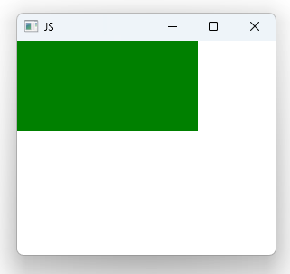

# Notes to self
    . Exploring JS usage in QML
        . Show its usage
            . in property bindings
            . in functions
            . in signal handlers

       
---

# Javascript  Usage


---

# Javascript Usage
```qml
     Rectangle {
        id : containerRectId
        width : getHeight()  //JS in Function
        height: 100
        color: x > 300 ? "red" : "green" //property binding

        //JS in signal handler
        onXChanged: {
            console.log("Current value of x : "+ x)
        }

        //Custom function
        function getHeight()
        {
            return  height * 2
        }
    }
```