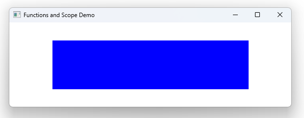

# Notes to self
         . Function scope is where you can call the function without getting an error.

         . Things you should know about JS functions in QML
         . A function you define on the root level like min below, is callable anywhere
            in child elements of the root element. For ex, min can be called inside Rectangle

         . Functions defined in nested elements can't be called from parent scopes without
            going through the id. See sayMessage here. You can't call it in Component.onCompleted
            without using the id.

       
---

# Functions and Scope


---

# Functions and Scope
```qml
Window {
    id : rootId
    function min ( a ,b)
    {
        return Math.min(a,b)
    }
    Rectangle {
        id : mRectId
    }
    MouseArea {
        id : mMouseAreaId
        function sayMessage()
        {
            console.log("Hello there")
        }
        onClicked: {
            sayMessage()
        }
    }
    Component.onCompleted: {
        console.log("The width of the rect is :"+ min(500,400))
        mMouseAreaId.sayMessage()
    }
}
```