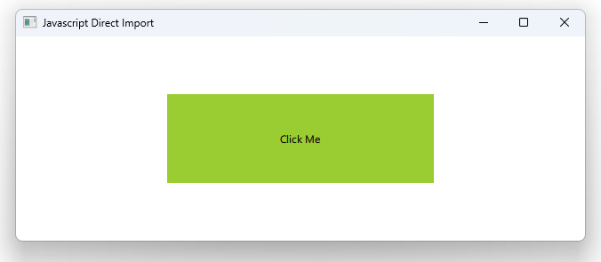

# Notes to self
        . Importing js files : https://doc.qt.io/qt-5/qtqml-javascript-imports.html
        . You add them as QML files in the CMake file
        . This lecture : Import js into QML
            . The syntax :
                . import "utilities1.js" as Utilities1
        . What if we want to import JS from another js file? That's indirect import.
            We cover that in the next lecture.

       
---

# JS Direct Import


---

# utilities1.js
```qml
function greeting()
{
    console.log("Hello there from external JS file utilities1.js")
}


```
---

# main.qml
```qml
import "utilities1.js" as Utilities1
Window {
    visible: true
    width: 640
    height: 480
    title: qsTr("Javascript Direct Import")

    Rectangle {
        color: "yellowgreen"
        MouseArea {
            anchors.fill: parent
            onClicked: {
               Utilities1.greeting()
            }
        }
    }
}
```