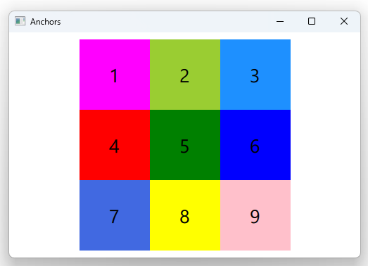

# Notes to self

        . Exploring anchors
            . We build a grid of rectangles
            . The first one , topLeftRectId, will show up in the top left corner
                of containerRectId. The rest will be positioned according to the position
                of topLeftRectId

             . Doc : https://doc.qt.io/qt-6/qtquick-positioning-anchors.html

             . Note that The bottom row will be positioned in terms of centerCenterRectId     
---

# Anchors


---

```qml
    Rectangle {
        id : containerRectId

        Rectangle {
            id : topLeftRectId
            width: 100
            height: width
            color: "magenta"
            Text{
                anchors.centerIn: parent
                text : "1"
            }
        }

        Rectangle {
            id : topCenterRectId
            width: 100
            height: width
            color: "yellowgreen"
            anchors.left: topLeftRectId.right
            Text{
                anchors.centerIn: parent
                text : "2"
            }
        }
    }
```