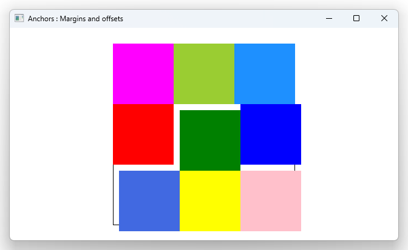

# Notes to self
        . Exploring anchors margins and offsets
        . Docs : https://doc.qt.io/qt-6/qtquick-positioning-anchors.html#anchor-margins-and-offsets

        . You can set margins to your anchors :
            . For the margin to work, there needs to be a related anchor already set.
                if the anchor isn't set, the margin won't work
            . For example, we have a top anchor set in the centerCenterRectId rectangle,
                so anchors.topMargin: 10 will work and add a 10 margin on top

            . Notice that the margin affects all elements anchored relative to centerCenterRectId

            . We don't have a right anchor, so the anchors.rightMargin: 10 setting won't work.

            . Next : You can only anchor to parent or sibling.    
---

# Anchors : Margins and Offsets


---

```qml
        Rectangle {
            id : centerCenterRectId
            width: 100
            height: width
            color: "green"

            //Using margins
            /*
            anchors.left: centerLeftRectId.right
            anchors.top: topRightRectId.bottom
            */

            //To allow center offsets
            anchors.horizontalCenter: parent.horizontalCenter
            anchors.verticalCenter: parent.verticalCenter

            //Margins
            /*
            //To have margins working, you have to set the anchor property on that anchor line
            //We don't have a right anchor in this rectangle, so a right margin won't work
            //There won't be any error, it'll simply not work and this may be hard to debug.
            //anchors.rightMargin: 10

            //This margin works because we have top anchor set.
            //Anything anchored to this rectangle will also be affected by the margin.
            //The entire bottom row will move down by 10
            anchors.topMargin: 10
            */

            //Offsets
            anchors.horizontalCenterOffset: 10
            anchors.verticalCenterOffset: 10
        }
```