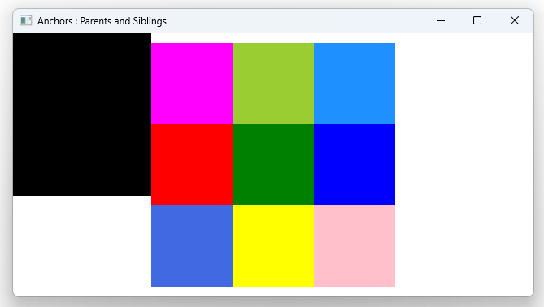

# Notes to self
        . Showing that you can only anchor to parent or sibling items.
        . We try to anchor topLeftRectId to siblingRect but that won't work :
                Rectangle {
                    id : topLeftRectId
                    width: 100
                    height: width
                    color: "magenta"

                    //This anchor won't work because siblingRect isn't either a
                    //sibling or a parent
                    anchors.top: siblingRect.bottom
                } 
---

# Anchors : Parents and Siblings


---

```qml
Window {

    Rectangle {
        id : containerRectId
        width: 300
        height: width
        border.color: "black"
        anchors.centerIn: parent

        Rectangle {
            id : topLeftRectId
            width: 100
            height: width
            color: "magenta"

            //This anchor won't work because siblingRect isn't either a ibling or a parent
            //anchors.top: siblingRect.bottom
        }
      
    }

    Rectangle {
        id : siblingRect
        width: 200
        height: 200
        color : "black"
        anchors.right: containerRectId.left
    }
}
```