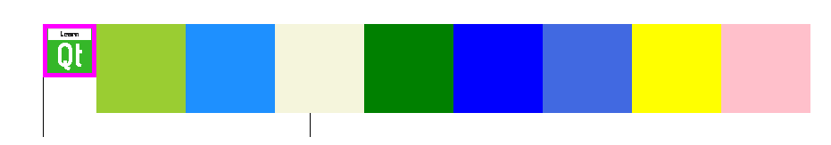

# Notes to self
        . Exploring positioners :
                . Grid
                . Row
                . Column

        . Show Grid with 3 columns
            . Change columns to 4 and 5 and discuss
        . Change to use Row
            . expand the window to see all 9 colored rects
         .Change to use Column :
            . Comment out the centering of containerRectId so you can see
                all the 9 colored rectangles
          . Turn back to Grid :
            . Show spacing :
                    . spacing: 10
                    . rowSpacing and columnSpacing
                    . Note that spacing:10 is equivalent to both setting {rowSpacing:10
                        and columnSpacing:10
            . Show alignment : Align topLeftRectId because it has a small size. The alignmnet
                will be visible:
                    . To make this fun, we add a LearnQt image into topLeftRectId just
                        to remind students how to work with Images.

                        . horizontalItemAlignment: Grid.AlignRight
                        .  verticalItemAlignment: Grid.AlignVCenter

            . Show mirroring :
                . LayoutMirroring.enabled: true
                . LayoutMirroring.childrenInherit: true 
---

# Positioning : Row


---

# Row
```qml
 import QtQuick 2.0

 Row {
     spacing: 2
     Rectangle { color: "red"; width: 50; height: 50 }
     Rectangle { color: "green"; width: 20; height: 50 }
     Rectangle { color: "blue"; width: 50; height: 20 }
 }

```

---

# Column
```qml
 Column {
     spacing: 2

     Rectangle { color: "red"; width: 50; height: 50 }
     Rectangle { color: "green"; width: 20; height: 50 }
     Rectangle { color: "blue"; width: 50; height: 20 }
 }

```

---

# Grid
```qml
 import QtQuick 2.0

 Grid {
     columns: 3
     spacing: 2
     Rectangle { color: "red"; width: 50; height: 50 }
     Rectangle { color: "green"; width: 20; height: 50 }
     Rectangle { color: "blue"; width: 50; height: 20 }
     Rectangle { color: "cyan"; width: 50; height: 50 }
     Rectangle { color: "magenta"; width: 10; height: 10 }
 }

```